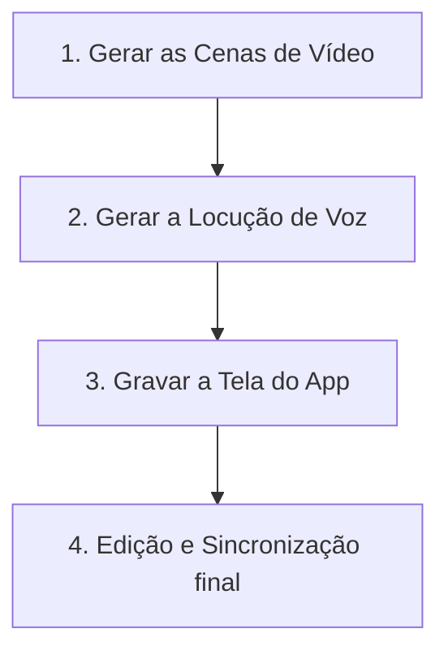

# 🛠️ Guia Passo a Passo: Como Gerar o Vídeo com IA

Este guia explica detalhadamente o fluxo de trabalho para gerar e montar o vídeo promocional do estoque do **Previna** utilizando ferramentas gratuitas e pagas de Inteligência Artificial de ponta.

---

## 🗺️ O Fluxo de Trabalho (Pipeline de Produção)

Para produzir o vídeo de 15 a 20 segundos sem precisar de câmeras, atores ou galpões físicos, siga estas 4 etapas:

---

## 📹 Etapa 1: Gerar os Clipes de Vídeo (IA de Vídeo)

Você utilizará os prompts de imagem-para-vídeo ou texto-para-vídeo que criamos no roteiro. 

### Ferramentas Recomendadas:
* **Luma Dream Machine** (Grátis para testar)
* **Runway Gen-3 Alpha** (Líder em realismo de movimento)
* **Kling AI** ou **Sora** (Se tiver acesso de desenvolvedor)

### Como Fazer:
1. Acesse a plataforma escolhida (ex: [Luma Dream Machine](https://lumalabs.ai/dream-machine) ou [Runway](https://runwayml.com/)).
2. Cole os prompts da seção **"Geração do Vídeo com Inteligência Artificial"** do roteiro.
3. Defina a proporção para **9:16 (Vertical)** nas configurações de geração.
4. Clique em gerar e baixe os clipes gerados (cada geração costuma ter entre 4 e 5 segundos).

---

## 🎙️ Etapa 2: Gerar a Voz da Locução (IA de Áudio)

Gerar uma voz natural em português para falar o texto do roteiro.

### Ferramentas Recomendadas:
* **ElevenLabs** (Vozes de IA mais realistas e naturais do mercado - tem plano grátis)
* **Narakeet** ou **Clipchamp** (Alternativas integradas)

### Como Fazer:
1. Acesse o [ElevenLabs](https://elevenlabs.io/).
2. Selecione a opção **Text to Speech**.
3. Escolha uma voz em português brasileiro masculina ou feminina que soe profissional e enérgica (ex: vozes como "Marcus", "Gigi" ou "Adam").
4. Insira o texto consolidado da locução:
   > *"Controlar o estoque do seu negócio não precisa ser complicado. Com o Previna, você atualiza e acompanha seu estoque de qualquer lugar. Cadastre-se grátis hoje mesmo."*
5. Baixe o arquivo de áudio em formato `.mp3`.

---

## 📱 Etapa 3: Captura de Tela da Interface Real (Opcional - Recomendado)

Para a cena em close-up do scanner (0:08 - 0:13), o vídeo ficará muito mais realista se você gravar a própria tela do Previna funcionando no seu celular.

### Como Fazer:
1. Abra o app **Previna** no seu celular.
2. Inicie o gravador de tela nativo do seu smartphone (iOS ou Android).
3. Abra a funcionalidade de leitor de código de barras e escaneie um produto de teste para mostrar a tela atualizando.
4. Recorte essa gravação no formato 9:16 para usar na edição.

---

## 🎬 Etapa 4: Edição e Sincronização (Editor de Vídeo)

Aqui você junta as peças (Vídeos gerados por IA + Gravação de Tela + Locução + Música de Fundo).

### Ferramentas Recomendadas:
* **CapCut** (Disponível para PC/Mac e Celular - Gratuito, muito fácil de usar e com ótimos templates)
* **Canva** (Bom para edições simples direto no navegador)
* **Premiere Pro / DaVinci Resolve** (Profissional)

### Passo a Passo no CapCut:
1. **Importar Ativos**: Crie um projeto vertical (9:16) e importe as 3 cenas geradas por IA, o `.mp3` da voz e a captura de tela do app.
2. **Organizar Linha do Tempo**:
   * **0s a 3s**: Clipe da empilhadeira manobrando.
   * **3s a 8s**: Clipe do operador tirando o celular do bolso.
   * **8s a 13s**: Gravação da tela real do app escaneando.
   * **13s a 17s**: Clipe do operador sorrindo / dando sinal de joia.
   * **17s a 20s**: Logo do Previna (você pode usar uma tela preta com o avatar neon e o site escrito).
3. **Adicionar a Voz**: Adicione o `.mp3` da voz e sincronize as falas com cada cena correspondente.
4. **Adicionar Legendas Automáticas**: Use a ferramenta **Texto > Legendas Automáticas** do CapCut. Ele transcreverá a locução automaticamente. Escolha uma fonte moderna (como Montserrat ou Bold Sans) e adicione animações de texto palavra por palavra (efeito "Pop" ou "Karaokê").
5. **Música de Fundo**: Escolha uma trilha sonora instrumental moderna e animada na biblioteca do CapCut (pesquise por "Tech Showcase" ou "Modern Beats"). Ajuste o volume da música para `-20dB` para que ela não abafe a voz da locução.
6. **Efeitos Sonoros**: Adicione um efeito de "Bip" exatamente no momento em que o código de barras for escaneado.
7. **Exportar**: Exporte em resolução 1080p, 30 ou 60 FPS, e o vídeo está pronto para postagem!
