# 📘 Manual Completo e Guia do Usuário — Plataforma Previna (Tenant Finance Flow)

Bem-vindo à documentação oficial e completa da plataforma **Previna**. Este guia foi elaborado para apresentar detalhadamente todas as funcionalidades, fluxos operacionais, regras de negócio e interfaces do sistema, acompanhado das telas e capturas reais de cada módulo (com todas as 29 telas limpas capturadas diretamente da aplicação ao vivo).

> 💡 **Dica de Visualização**: Você também pode abrir o arquivo compilado em PDF **[MANUAL_DO_SISTEMA.pdf](./MANUAL_DO_SISTEMA.pdf)** ou a versão web com fotos embutidas **[MANUAL_DO_SISTEMA.html](./MANUAL_DO_SISTEMA.html)** para folhear como um livro com todas as imagens integradas.

---

## 📑 Sumário

1. [Visão Geral e Landing Page Institucional](#1-visão-geral-e-landing-page-institucional)
2. [Acesso, Autenticação e Segurança](#2-acesso-autenticação-e-segurança)
3. [Dashboard Principal & Inteligência Financeira](#3-dashboard-principal--inteligência-financeira)
4. [Lançamentos Financeiros (Extrato Geral)](#4-lançamentos-financeiros-extrato-geral)
5. [Modal Unificado de Lançamentos (TransactionDialog)](#5-modal-unificado-de-lançamentos)
6. [Gestão de Contas a Receber](#6-gestão-de-contas-a-receber)
7. [Gestão de Contas a Pagar](#7-gestão-de-contas-a-pagar)
8. [Modo Loja & Frente de Caixa Touch (PDV)](#8-modo-loja--frente-de-caixa-touch-pdv)
9. [Pedidos de Venda](#9-pedidos-de-venda)
10. [Ordens de Serviço (O.S.)](#10-ordens-de-serviço-os)
11. [Gestão de Clientes (CRM)](#11-gestão-de-clientes-crm)
12. [Gestão de Fornecedores](#12-gestão-de-fornecedores)
13. [Agenda de Serviços & Grade Horária Diária](#13-agenda-de-serviços--grade-horária-diária)
14. [Gestão de Escalas de Trabalho (Agenda)](#14-gestão-de-escalas-de-trabalho-agenda)
15. [Estoque, Hub de Perecíveis & Validades](#15-estoque-hub-de-perecíveis--validades)
16. [Relatórios Gerenciais (Suite Completa de 8 Relatórios)](#16-relatórios-gerenciais-suite-completa)
    * 16.1 [DRE Simplificado](#161-dre-simplificado)
    * 16.2 [Comissões de Atendentes](#162-comissões-de-atendentes)
    * 16.3 [Distribuição de Despesas](#163-distribuição-de-despesas)
    * 16.4 [Fluxo de Caixa Projetado](#164-fluxo-de-caixa-projetado)
    * 16.5 [Ponto de Equilíbrio (Break-Even)](#165-ponto-de-equilíbrio-break-even)
    * 16.6 [Contas Pagar / Receber (Provisões)](#166-contas-pagar--receber-provisões)
    * 16.7 [Análise de Margens](#167-análise-de-margens)
    * 16.8 [Estoque, Curva ABC e Kardex](#168-estoque-curva-abc-e-kardex)
17. [Central de Notificações & Alertas](#17-central-de-notificações--alertas)
18. [Configurações da Empresa & Formas de Pagamento](#18-configurações-da-empresa--formas-de-pagamento)
19. [Faturamento, Planos & Quotas de NFS-e](#19-faturamento-planos--quotas-de-nfs-e)
20. [Experiência Mobile & Responsividade Touch](#20-experiência-mobile--responsividade-touch)

---

## 1. Visão Geral e Landing Page Institucional

A porta de entrada da plataforma apresenta a proposta de valor, planos comerciais, depoimentos e canal de suporte para novos clientes.

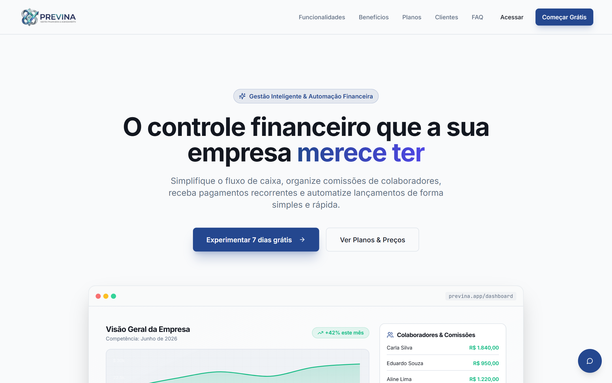

* **Navegação Intuitiva**: Apresentação clara dos módulos da solução (Financeiro, PDV, Estoque, Vendas e Agenda).
* **Conversão Direta**: Botões de chamada para ação direcionando para teste grátis ou autenticação.
* **Tabela Comercial**: Detalhamento dos planos de assinatura e recursos incluídos.

---

## 2. Acesso, Autenticação e Segurança

Acesso centralizado com criptografia de ponta a ponta e proteção multi-tenant via Row Level Security (RLS).

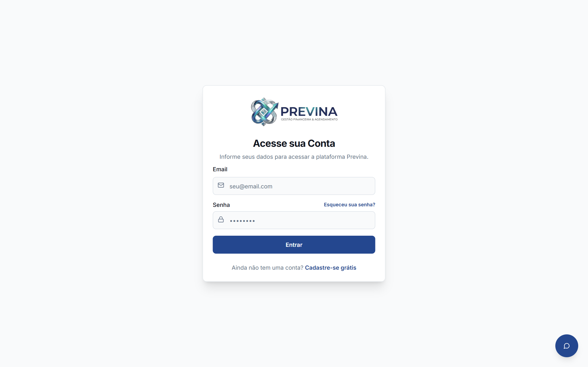

* **Login Seguro**: Acesso por e-mail e senha com validação em tempo real.
* **Recuperação de Acesso**: Fluxo automatizado de redefinição de senha por e-mail.
* **Criação de Conta**: Cadastro em 1 clique com direcionamento automático para o onboarding guiado.

---

## 3. Dashboard Principal & Inteligência Financeira

O painel central reúne a saúde financeira e operacional do negócio em tempo real, permitindo decisões imediatas baseadas em dados consolidados.

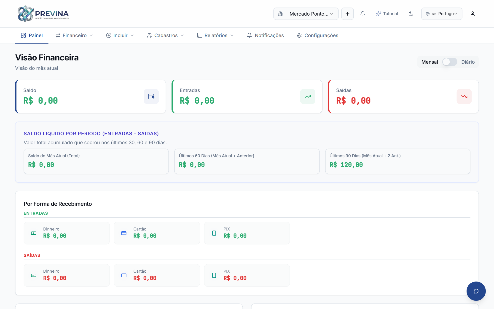

* **Cards de Indicadores (KPIs)**: Faturamento Bruto, Despesas Totais, Saldo Líquido e Contas em Aberto.
* **Gráfico de Fluxo de Caixa Mensal**: Comparativo em barras (Entradas vs Saídas) para análise de sazonalidade.
* **Distribuição de Despesas por Categoria**: Gráfico de pizza interativo exibindo o peso de cada centro de custo.
* **Lançamentos Recentes & Atalhos**: Tabela com as últimas transações e botões no topo para novo lançamento rápido.

---

## 4. Lançamentos Financeiros (Extrato Geral)

Visualização completa em tabela de todas as movimentações financeiras da empresa.

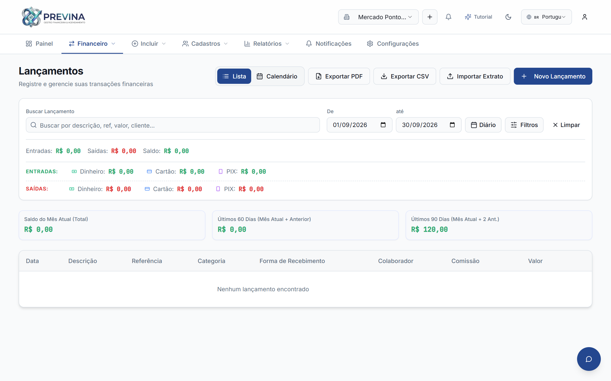

* **Filtros Dinâmicos**: Período, tipo (Receita/Despesa), status (Pago/Pendente), categorias com busca textual inteligente e formas de pagamento.
* **Exportação Multiformato**: Download em PDF corporativo e planilhas editáveis Excel (.xlsx/.csv).
* **Badges Visuais**: Identificação de liquidação e vínculo direto com pedidos de venda.

---

## 5. Modal Unificado de Lançamentos

Centralização de cadastro tanto para receitas quanto para despesas (`TransactionDialog`), eliminando formulários duplicados.

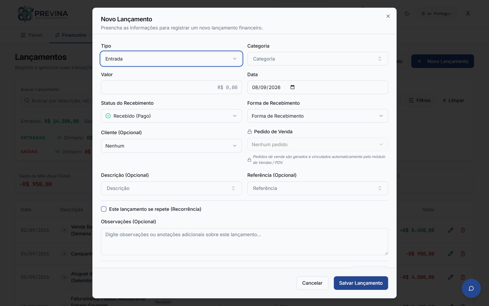

* **Validações Rígidas**: Descrição, Valor em Real (R$), Categoria, Data de Competência, Forma de Pagamento e Status.
* **Vínculo com Pedidos de Venda**: Preenchimento automático de cliente e valor ao selecionar um pedido.
* **Separação de Status e Meio**: Permite registrar a forma de pagamento (ex: Boleto) mantendo o status "Pendente" até a compensação.

---

## 6. Gestão de Contas a Receber

Controle rigoroso dos recebíveis com análise de inadimplência e projeção de entradas futuras.

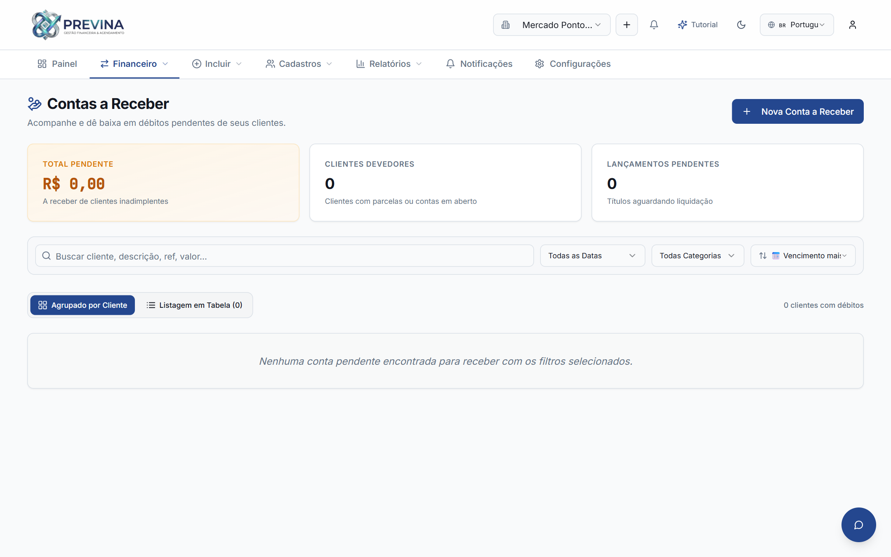

* **Dupla Visualização**:
  * **Agrupada por Cliente**: Accordions colapsáveis exibindo o total devedor por cliente e a data do vencimento mais próximo.
  * **Tabela Plana**: Listagem individual direta com ordenação por urgência.
* **Gráfico de Fluxo Futuro**: Projeção mês a mês dos valores a receber.
* **Baixa Parcial com Desmembramento**: Ao receber um pagamento parcial, o sistema baixa o valor recebido e gera automaticamente um novo lançamento com o saldo restante.

---

## 7. Gestão de Contas a Pagar

Planejamento de desembolsos para fornecedores, impostos e despesas fixas.

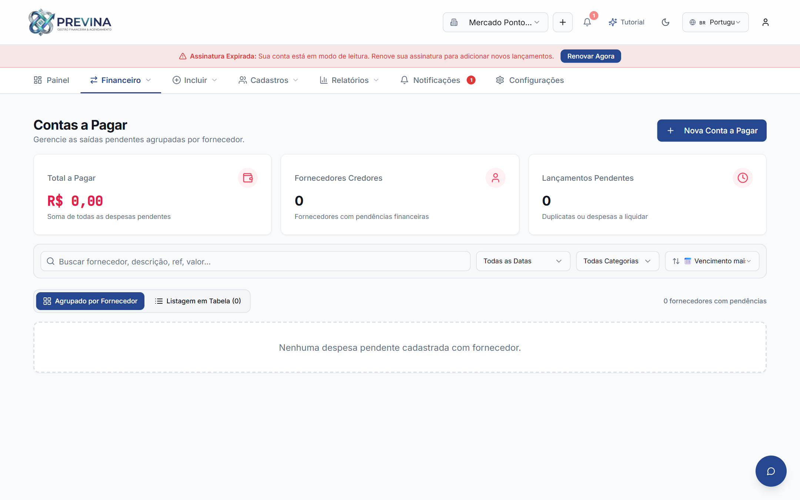

* **Alertas Visuais**: Destaque em vermelho para contas atrasadas e amarelo para contas vencendo no dia.
* **Baixa Rápida de Duplicatas**: Quitação individual com registro de descontos ou juros negociados.
* **Gráfico de Previsão de Despesas**: Curva cronológica dos desembolsos futuros.

---

## 8. Modo Loja & Frente de Caixa Touch (PDV)

Frente de caixa ágil projetada para atendimento balcão de alta velocidade em comércios e prestadores de serviços rápidos.

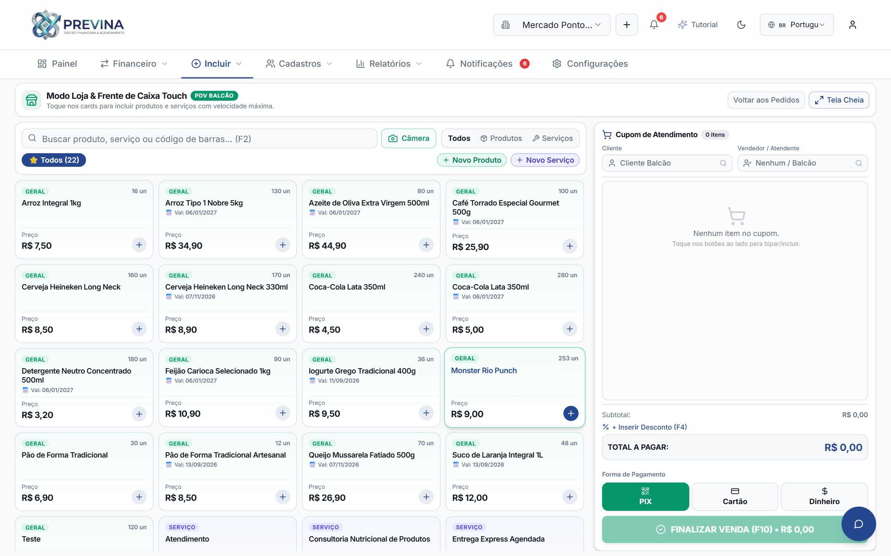

* **Catálogo Touchscreen**: Grid responsivo com fotos, preços e pílulas de categorias (Bebidas, Alimentos, Serviços, etc.).
* **Cupom Digital de Atendimento**: Exibição lateral em tempo real dos itens, quantidades com botões `+` e `-`, subtotais, descontos e total destacado.
* **Leitor de Código de Barras Híbrido**: Suporte a leitor físico USB, câmera do computador ou celular pareado via Supabase Realtime QR Code.
* **Teclas de Atalho de Alta Produtividade**:
  * `F2`: Finalizar Venda
  * `F4`: Abrir Leitor de Código de Barras
  * `F8`: Limpar Carrinho
  * `F10`: Alternar Modo Tela Cheia (Kiosk)
* **Checkout Descomplicado**: Dinheiro (com calculadora de troco express), Cartões, PIX e Formas Personalizadas, com modal de confirmação antes de concluir para evitar erros.

---

## 9. Pedidos de Venda

Gestão comercial completa para vendas corporativas, orçamentos e encomendas.

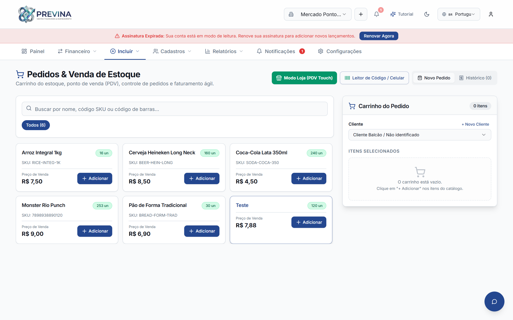

* **Fluxo de Status**: Orçamento -> Aprovado -> Faturado -> Entregue -> Cancelado.
* **Impressão Comercial**: Geração de Cupom Térmico (80mm) ou PDF Comercial formatado com dados da empresa, cliente, itens, totalizadores e assinaturas.
* **Sincronização Total**: Baixa automática de estoque no Kardex e lançamento direto no Contas a Receber.

---

## 10. Ordens de Serviço (O.S.)

Especialmente desenvolvida para oficinas, assistências técnicas, consultorias e prestadores em geral.

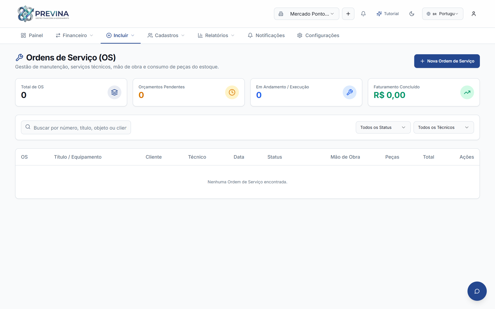

* **Composição Mista**: Lançamento conjunto de peças substituídas (com baixa automática de estoque) e serviços de mão de obra prestados.
* **Controle de Equipamento e Diagnóstico**: Registro do item em reparo, defeito relatado, laudo técnico executado e termo de garantia.
* **Emissão de Laudo Técnico**: Impressão de comprovante em PDF e integração com faturamento.

---

## 11. Gestão de Clientes (CRM)

Base centralizada de clientes com histórico de relacionamento e inteligência comercial.

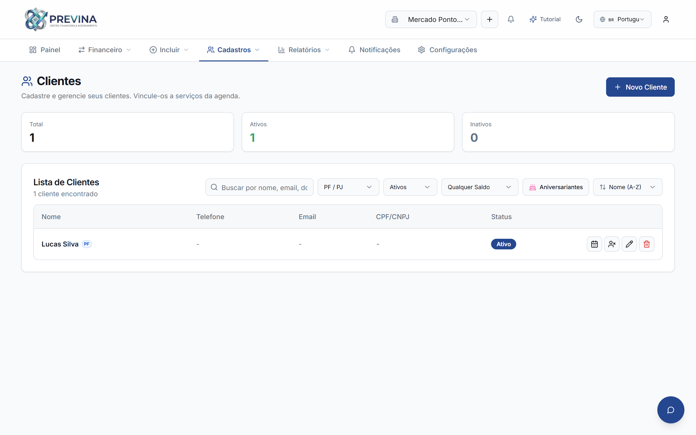

* **Ficha Cadastral Completa**: Pessoa Física (CPF) e Pessoa Jurídica (CNPJ), endereço, telefones e e-mail.
* **Filtros Especiais**: Clientes com débitos em aberto ou aniversariantes do mês para ações promocionais.
* **Histórico Unificado**: Acesso direto a todas as compras, agendamentos e pendências financeiras.

---

## 12. Gestão de Fornecedores

Controle de parceiros comerciais, distribuidores e prestadores terceirizados.

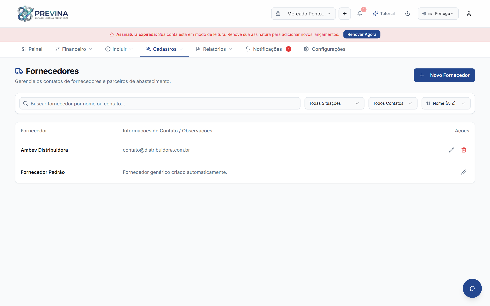

* **Controle de Prazos e Saldos**: Visualize rapidamente quanto a sua empresa deve a cada fornecedor.
* **Dados de Contato e Vendedores**: Armazenamento de representantes comerciais para reposição de mercadorias.

---

## 13. Agenda de Serviços & Grade Horária Diária

Linha do tempo dinâmica com slots horários precisos para atendimento ao cliente.

* **Slots Vagos Clicáveis**: Clique em qualquer horário livre para abrir o agendamento pré-preenchido.
* **Detecção Ativa de Conflitos**: O sistema impede agendamentos sobrepostos para o mesmo profissional ou mesmo cliente.
* **Status em Cores**: Identificação clara de agendamentos agendados, confirmados, em atendimento, concluídos ou faltas.
* **Cadastro Rápido Inline**: Inclusão de novos clientes sem sair do formulário de agendamento.

---

## 14. Gestão de Escalas de Trabalho (Agenda)

Controle dos dias de expediente e jornadas de trabalho da equipe.

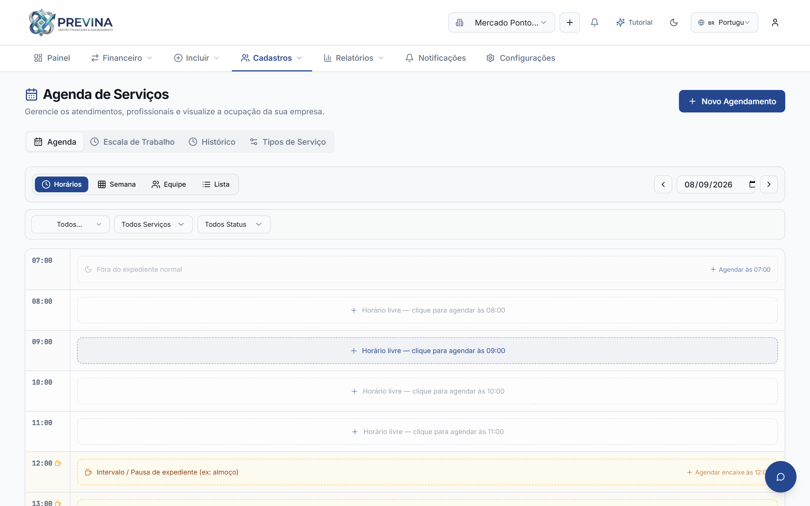

* **Múltiplos Turnos por Dia**: Suporte a jornadas fracionadas (ex: 08:00 às 12:00 e 14:00 às 18:00), criando automaticamente a pausa de almoço/intervalo.
* **Escala Geral vs Individual**: Configure o horário padrão da empresa e especifique exceções por colaborador.
* **Replicador de Dias Úteis**: Botão rápido para replicar os horários de Segunda a Sexta em um único clique.
* **Reflexo Visual na Grade**: Horários fora de expediente e intervalos de almoço são hachurados visualmente na grade da agenda.

---

## 15. Estoque, Hub de Perecíveis & Validades

Controle minucioso de cada item comercializado pela empresa, assegurando que nenhum produto seja perdido por vencimento ou ruptura de estoque.

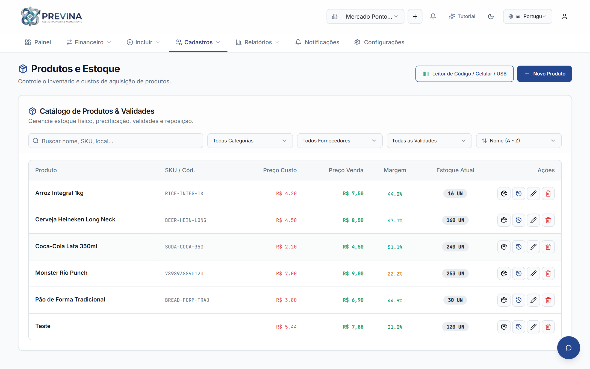

* **Hub Interativo de Perecíveis (No Topo da Tela)**:
  * Painel de risco financeiro exibindo a quantidade de itens próximos do vencimento e o **capital total em risco**.
  * Badges dinâmicos com contagem regressiva de validade (ex: "Vence em 3 dias", "Vencido").
  * Botão de **Baixa Rápida por Descarte/Vencimento**, atualizando o saldo imediatamente e gravando a justificativa no Kardex.
* **Cadastro Completo de Mercadoria**: Preço de custo, margem de lucro, preço de venda e estoque mínimo com alertas preventivos.

---

## 16. Relatórios Gerenciais (Suite Completa)

O Previna conta com uma suíte analítica com **8 relatórios especializados**, cobrindo todas as dimensões do negócio:

### 16.1 DRE Simplificado
Demonstração contábil do resultado do exercício para apuração de lucro líquido real e margem de contribuição.

* Estrutura formal: Receita Bruta, Deduções, Receita Líquida, CMV/CPV, Lucro Bruto e Despesas Operacionais.
* Abertura em subcategorias detalhadas para identificação precisa de custos e exportação em PDF/Excel.

### 16.2 Comissões de Atendentes
Apuração automática de comissões por colaborador sobre serviços prestados e produtos vendidos.

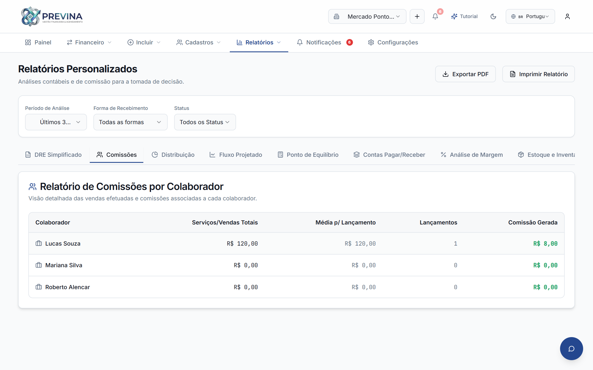

* Total faturado versus total de comissão devida no período selecionado.
* Transparência total para fechamento de folha de pagamento e metas.

### 16.3 Distribuição de Despesas
Análise gráfica da dispersão de receitas e custos por centro de custos e categorias financeiras.

* Gráficos comparativos de pizza e dispersão para identificação dos maiores centros de consumo de caixa.

### 16.4 Fluxo de Caixa Projetado
Projeção preditiva do saldo bancário baseada nos recebíveis e pagáveis futuros.

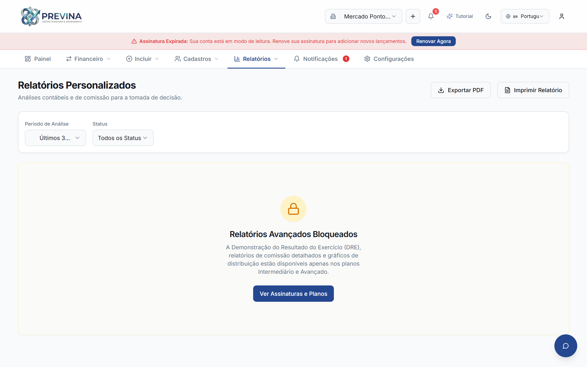

* Simulação para horizontes de 30, 60 e 90 dias, prevenindo descasamento de liquidez.

### 16.5 Ponto de Equilíbrio (Break-Even)
Cálculo econômico da receita mínima necessária para cobrir todos os custos fixos operacionais.

* Aponta o dia exato do mês em que a empresa ultrapassa os custos e passa a operar no lucro líquido.

### 16.6 Contas Pagar / Receber (Provisões)
Cruzamento comparativo de provisões financeiras com agrupamento diário ou mensal dinâmico.

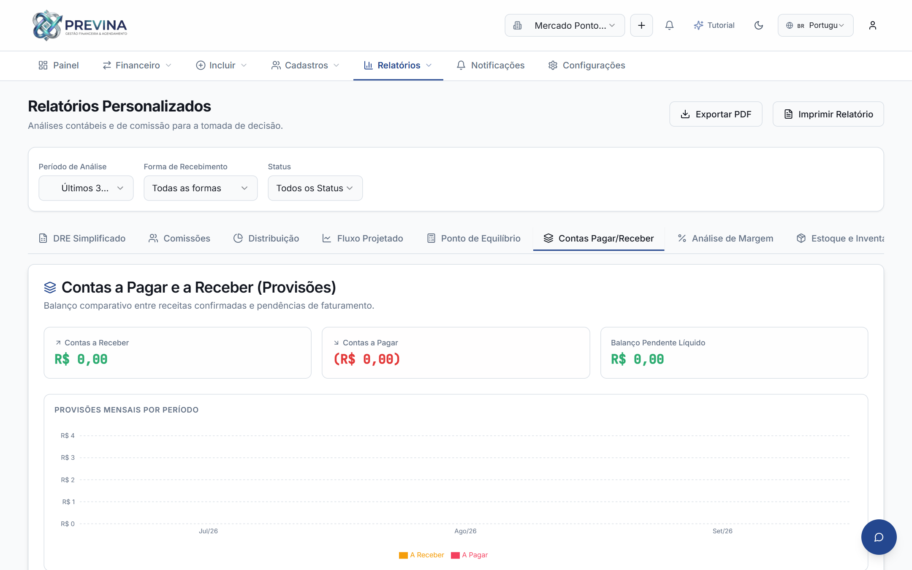

* Gráfico de barras comparativas entre entradas e saídas previstas para o período.

### 16.7 Análise de Margens
Diagnóstico de rentabilidade e markup produto a produto e serviço a serviço.

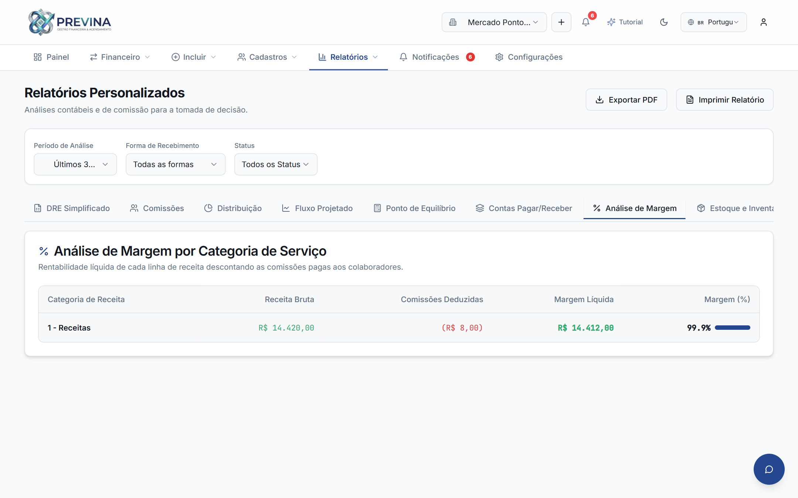

* Identificação dos itens de maior contribuição marginal e produtos que operam abaixo da margem ideal.

### 16.8 Estoque, Curva ABC e Kardex
Suite analítica avançada de inventário com 5 visões em um único relatório.

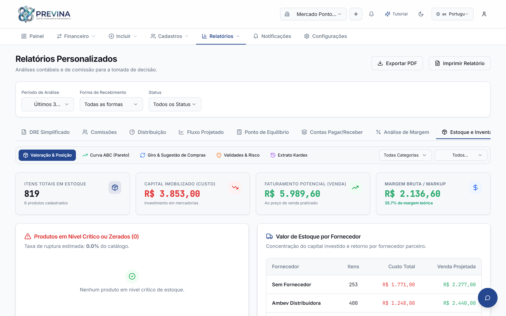

* **Curva ABC (Gráfico de Pareto)**: Identificação dos 20% dos produtos que representam 80% do faturamento.
* **Giro de Estoque e Dias de Cobertura**: Cálculo do consumo médio diário para prever a duração do estoque.
* **Sugestão Automatizada de Compras**: Quantidade ideal a comprar e custo estimado de reposição.
* **Extrato Auditor Kardex**: Histórico cronológico completo de entradas, saídas, vendas e perdas.

---

## 17. Central de Notificações & Alertas

A plataforma monitora ativamente as operações e antecipa problemas através de um centro de alertas inteligente.

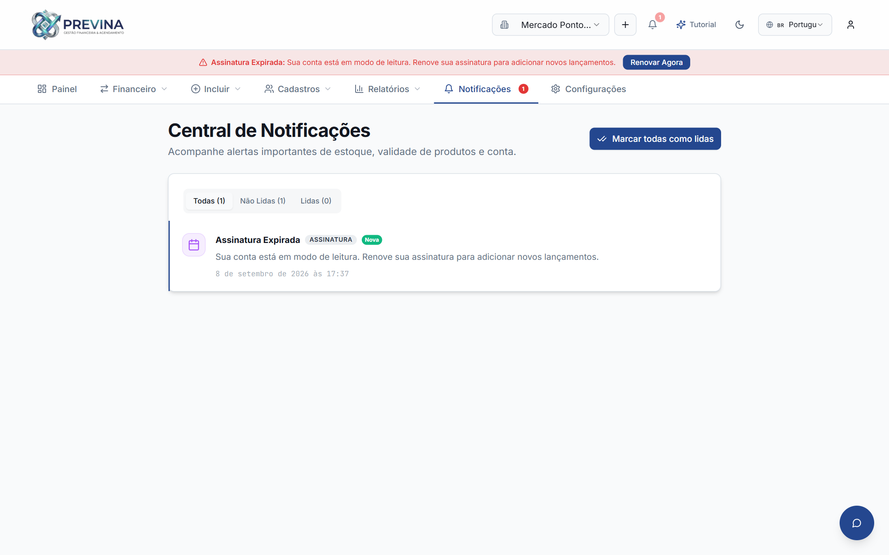

* **Sino com Contador em Tempo Real**: Exibição permanente no cabeçalho.
* **Tipos de Alerta**: Contas a pagar/receber vencendo hoje ou atrasadas, ruptura de estoque e validades críticas.

---

## 18. Configurações da Empresa & Formas de Pagamento

### 18.1 Dados da Empresa & Perfil
Configuração cadastral dos dados da empresa, logotipo oficial e parâmetros operacionais do tenant.

### 18.2 Formas de Pagamento Personalizadas
Criação e manutenção de métodos de recebimento personalizados além dos padrões de mercado.

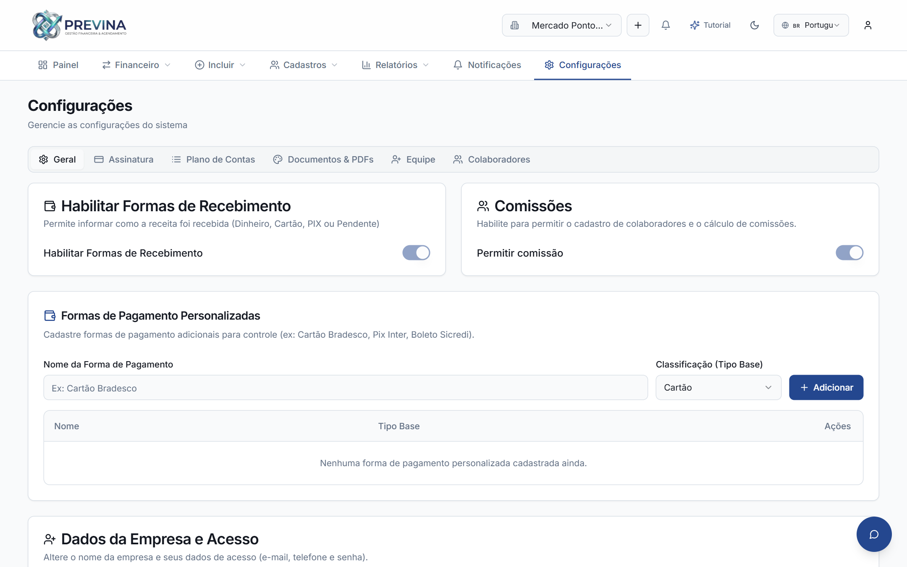

* **Cadastro Livre**: Adicione formas como "Crediário Próprio", "Boleto 30 Dias", "Vale Alimentação", etc.
* **Reflexo Imediato**: Disponibilidade automática no PDV Touch, Pedidos e Lançamentos Financeiros.

---

## 19. Faturamento, Planos & Quotas de NFS-e

Gestão da assinatura SaaS da empresa na plataforma Previna.

* **Status da Conta e Renovação**: Plano ativo, data de renovação e valor da mensalidade com pagamento via Cartão ou PIX.
* **Quotas de Emissão de Notas Fiscais (NFS-e Asaas)**: Barra de progresso visual exibindo as notas emitidas versus a franquia contratada.

---

## 20. Experiência Mobile & Responsividade Touch

Projetada desde a base para oferecer a mesma velocidade e poder de gestão na tela de um smartphone.

### 20.1 Frente de Caixa & PDV Touch no Celular
Interface compacta otimizada para toque com botões amplos e cupom flutuante.

* **Cupom Flutuante de Checkout**: O operador navega pelo catálogo em tela cheia e expande o carrinho na hora do pagamento.
* **Botão de Suporte Elevado**: O widget flutuante de atendimento fica elevado estrategicamente para não cobrir a barra de navegação do celular.

### 20.2 Barra Inferior Fixa & Gaveta Geral de Módulos (Menu Sheet)
Navegação ergonômica com uma única mão.

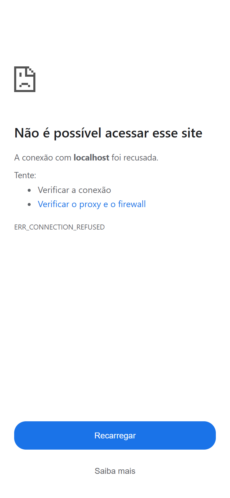

* **Navegação Rápida**: Acesso instantâneo a Início, Finanças, PDV e Vendas.
* **Gaveta de Módulos (Sheet)**: Acesso rápido a todos os grupos (Financeiro, Vendas, Cadastros e Análise).

---

## 📌 Conclusão

A plataforma **Previna** oferece uma solução integrada, robusta e intuitiva para o gerenciamento de empresas de qualquer porte. Todos os arquivos de documentação, PDF e capturas de tela estão disponíveis no repositório.
