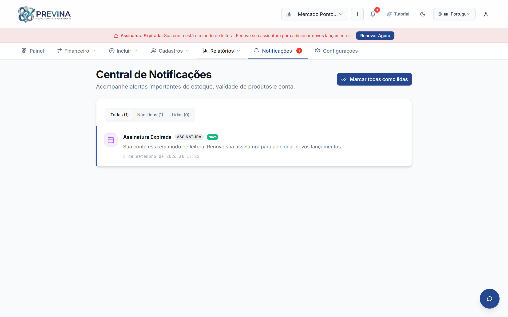
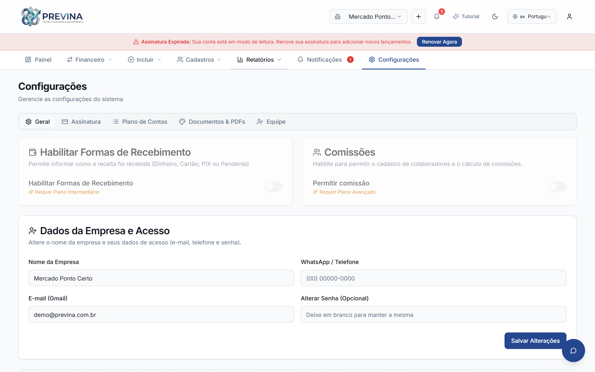
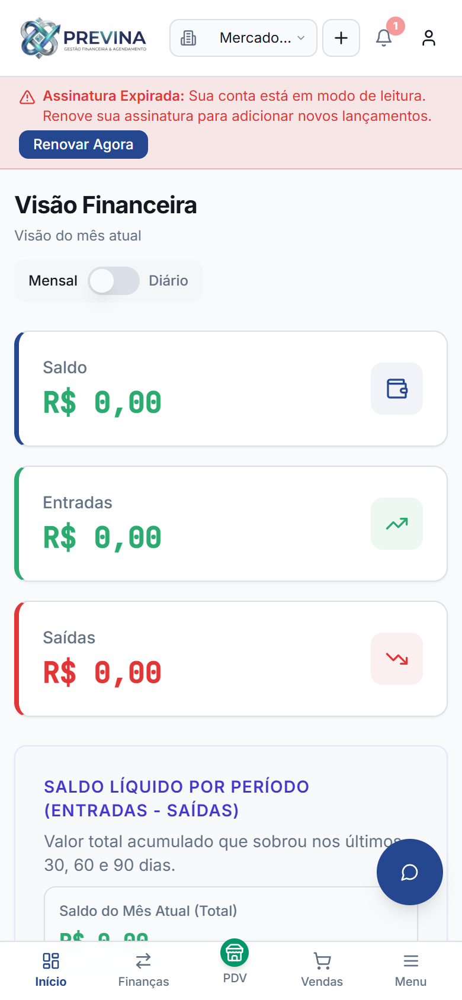
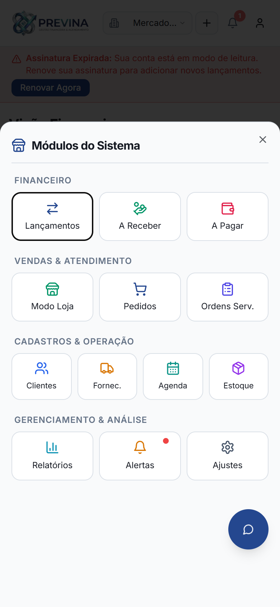

# 📘 Manual Completo e Guia do Usuário — Plataforma Previna (Tenant Finance Flow)

Bem-vindo à documentação oficial e completa da plataforma **Previna**. Este guia foi elaborado para apresentar detalhadamente todas as funcionalidades, fluxos operacionais, regras de negócio e interfaces do sistema, acompanhado das telas e capturas reais de cada módulo.

---

## 📑 Sumário

1. [Visão Geral e Arquitetura da Plataforma](#1-visão-geral-e-arquitetura-da-plataforma)
2. [Acesso, Autenticação e Segurança](#2-acesso-autenticação-e-segurança)
3. [Dashboard Principal & Indicadores Executivos](#3-dashboard-principal--indicadores-executivos)
4. [Módulo Financeiro (Lançamentos, Recebíveis e Pagáveis)](#4-módulo-financeiro)
5. [Vendas, Atendimento & Frente de Caixa (PDV Touch)](#5-vendas-atendimento--frente-de-caixa-pdv-touch)
6. [Ordens de Serviço e Pedidos de Venda](#6-ordens-de-serviço-e-pedidos-de-venda)
7. [Cadastros & CRM (Clientes e Fornecedores)](#7-cadastros--crm-clientes-e-fornecedores)
8. [Agenda de Serviços & Gestão de Escalas de Trabalho](#8-agenda-de-serviços--gestão-de-escalas-de-trabalho)
9. [Estoque, Hub de Perecíveis & Validades](#9-estoque-hub-de-perecíveis--validades)
10. [Relatórios Gerenciais, DRE e Kardex](#10-relatórios-gerenciais-dre-e-kardex)
11. [Central de Notificações & Alertas](#11-central-de-notificações--alertas)
12. [Configurações, Formas de Pagamento & Planos](#12-configurações-formas-de-pagamento--planos)
13. [Experiência Mobile e Responsividade Touch](#13-experiência-mobile-e-responsividade-touch)

---

## 1. Visão Geral e Arquitetura da Plataforma

O **Previna** é um ecossistema SaaS multi-tenant completo voltado para gestão financeira, comercial, estoque e agendamentos de prestadores de serviço e comércios.

### Principais Pilares do Sistema:
* **Multi-tenancy com Isolamento RLS**: Segurança em nível de linha (Row Level Security via Supabase), garantindo que os dados de cada empresa sejam totalmente blindados.
* **Automação Financeira**: Integração nativa entre Vendas, Ordens de Serviço, Estoque e Fluxo de Caixa.
* **PDV Touch Ultrarrápido**: Frente de caixa ágil com atalhos de teclado, suporte a leitor de código de barras USB e pareamento com câmera de celular.
* **Agenda Inteligente**: Múltiplas visões com detecção em tempo real de choque de horários e gestão flexível de escalas de colaboradores com turnos/almoço.
* **Gestão de Validades & Curva ABC**: Inventário completo com rastreamento Kardex e controle de perecíveis.

---

## 2. Acesso, Autenticação e Segurança

### 2.1 Landing Page Pública Institucional
A porta de entrada da plataforma apresenta a proposta de valor, planos comerciais, depoimentos e canal de suporte.

* **Navegação Intuitiva**: Apresentação clara dos recursos (Financeiro, PDV, Estoque, Agenda).
* **Conversão Direta**: Botões de chamada para ação direcionando para teste grátis ou autenticação.

### 2.2 Autenticação Segura (Login / Cadastro)
Acesso centralizado com criptografia de ponta a ponta e proteção contra acessos não autorizados.

* **Login Rápido**: Acesso por e-mail e senha com validação em tempo real.
* **Recuperação de Senha**: Fluxo simplificado de redefinição via e-mail corporativo.
* **Criação de Conta**: Cadastro em 1 clique com direcionamento automático para o onboarding guiado.

---

## 3. Dashboard Principal & Indicadores Executivos

O painel central reúne a saúde financeira e operacional do negócio em um único lugar, permitindo tomadas de decisão imediatas baseadas em dados consolidados.

### Elementos da Tela:
1. **Cards de Resumo (KPIs)**:
   * **Faturamento Bruto**: Total de receitas consolidadas no período selecionado.
   * **Despesas Totais**: Gastos operacionais, compras e custos fixos liquidados.
   * **Saldo Líquido**: Lucro real obtido com indicador comparativo de evolução percentual.
   * **Previsão de Recebíveis / Pagáveis**: Visão instantânea dos valores em aberto.
2. **Gráfico de Fluxo de Caixa Mensal**:
   * Comparativo em barras (Verde/Azul para Entradas, Vermelho para Saídas) evidenciando a sazonalidade e tendências do negócio.
3. **Distribuição de Despesas por Categoria**:
   * Gráfico de pizza interativo exibindo o peso de cada centro de custo (aluguel, fornecedores, folha, marketing).
4. **Lançamentos Recentes & Atalhos**:
   * Tabela resumida com as últimas transações e botões de atalho rápido no topo para lançar receitas ou despesas com um clique.

---

## 4. Módulo Financeiro

O módulo financeiro do Previna gerencia todas as entradas, saídas, parcelamentos e baixas com total rastreabilidade.

### 4.1 Lançamentos Financeiros (Extrato Geral)
Visualização completa em tabela de todas as transações da empresa.

* **Filtros Dinâmicos**: Filtre por período, tipo (Receita/Despesa), status (Pago/Pendente), categorias com busca textual inteligente e formas de pagamento.
* **Exportação Multiformato**: Geração de relatórios em PDF corporativo e planilhas Excel (.xlsx/.csv).
* **Badges Visuais**: Identificação imediata se a conta está quitada, pendente ou vinculada a um Pedido de Venda.

### 4.2 Modal Unificado de Lançamento (`TransactionDialog`)
Centralização de cadastro tanto para receitas quanto para despesas, eliminando duplicidade de formulários.

* **Campos Obrigatórios Validados**: Descrição, Valor com máscara em Real (R$), Categoria, Data de Competência, Forma de Pagamento e Status.
* **Vínculo com Pedidos de Venda**: Permite vincular uma receita a um pedido existente, preenchendo automaticamente cliente e valor.
* **Separação de Status e Meio de Pagamento**: Permite registrar, por exemplo, que a forma escolhida foi "Boleto", mas o status permanece "Pendente" até a compensação.

### 4.3 Contas a Receber
Controle rigoroso dos recebíveis com análise de inadimplência e projeção de entradas futuras.

* **Alternância de Visão**:
  * **Agrupada por Cliente**: Accordions colapsáveis exibindo o total devedor por cliente e a data do vencimento mais próximo.
  * **Tabela Plana**: Listagem individual direta com ordenação por urgência.
* **Gráfico de Fluxo Futuro**: Projeção mês a mês dos valores a receber.
* **Baixa Parcial com Desmembramento**: Se um cliente pagar apenas parte do débito, o sistema baixa o valor pago e gera automaticamente um novo lançamento com o saldo devedor restante.

### 4.4 Contas a Pagar
Planejamento de desembolsos para fornecedores, impostos e despesas fixas.

* **Alertas de Vencimento**: Destaque visual em vermelho para contas em atraso e amarelo para contas vencendo no dia.
* **Baixa Rápida de Duplicatas**: Quitação individual com possibilidade de registrar juros ou descontos negociados.

---

## 5. Vendas, Atendimento & Frente de Caixa (PDV Touch)

O **Modo Loja** foi desenvolvido para atendimento balcão de alta velocidade, atendendo tanto comércios varejistas quanto empresas de serviços rápidos.

### Funcionalidades do PDV:
* **Catálogo Touchscreen**: Grid responsivo de produtos e serviços com fotos, valores e filtros rápidos em pílulas (Bebidas, Alimentos, Serviços, etc.).
* **Cupom Digital de Atendimento**: Exibição lateral em tempo real dos itens inseridos, quantidades com botões `+` e `-`, subtotais, descontos e total destacado.
* **Leitor de Código de Barras Híbrido**:
  * Suporte nativo a leitores de código de barras físicos (USB/Bluetooth).
  * Leitor com câmera embutida com mira laser visual e feedback sonoro/vibratório.
  * Pareamento com celular remoto via QR Code em tempo real (Supabase Realtime).
* **Teclas de Atalho**:
  * `F2`: Finalizar Venda
  * `F4`: Abrir Leitor de Código de Barras
  * `F8`: Limpar Carrinho
  * `F10`: Alternar Modo Tela Cheia (Kiosk)
* **Checkout Descomplicado**:
  * Seleção de forma de pagamento: **Dinheiro** (com calculadora automática de troco), **Cartão de Crédito/Débito**, **PIX** e Formas Personalizadas.
  * Modal de confirmação antes de concluir, exibindo resumo completo da venda para evitar finalizações por engano.
  * Baixa imediata de estoque no Kardex e lançamento direto no Financeiro.

---

## 6. Ordens de Serviço e Pedidos de Venda

### 6.1 Pedidos de Venda
Gestão comercial completa para vendas corporativas, orçamentos e encomendas.

* **Fluxo de Status**: Orçamento -> Aprovado -> Faturado -> Entregue -> Cancelado.
* **Impressão Comercial**: Geração de Cupom Térmico (80mm) ou PDF Comercial formatado com dados da empresa, cliente, itens, totalizadores e assinaturas.

### 6.2 Ordens de Serviço (O.S.)
Especialmente desenvolvida para oficinas, assistências técnicas, consultorias e prestadores em geral.

* **Composição Mista**: Lançamento conjunto de peças substituídas (com baixa automática de estoque) e serviços de mão de obra prestados.
* **Controle de Equipamento e Diagnóstico**: Registro do item em reparo, defeito relatado, laudo técnico executado e garantia fornecida.

---

## 7. Cadastros & CRM (Clientes e Fornecedores)

### 7.1 Gestão de Clientes (CRM)
Base centralizada de clientes com histórico de relacionamento e inteligência comercial.

* **Ficha Cadastral Completa**: Suporte a Pessoa Física (CPF) e Pessoa Jurídica (CNPJ), endereço, telefones e e-mail.
* **Filtros Especiais**: Filtre clientes com débitos em aberto ou aniversariantes do mês para ações promocionais.
* **Histórico Unificado**: Acesso direto a todas as compras, agendamentos e pendências financeiras daquele cliente.

### 7.2 Gestão de Fornecedores
Controle de parceiros comerciais, distribuidores e prestadores terceirizados.

* **Controle de Prazos e Saldos**: Visualize rapidamente quanto a sua empresa deve a cada fornecedor.
* **Dados de Contato e Vendedores**: Armazenamento de representantes comerciais para reposição de mercadorias.

---

## 8. Agenda de Serviços & Gestão de Escalas de Trabalho

O módulo de Agenda organiza o fluxo de atendimento da equipe, eliminando faltas e conflitos de horários.

### 8.1 Grade Horária Diária (`ScheduleTimelineView`)
Visualização em linha do tempo dinâmica com slots horários precisos.

* **Slots Vagos Clicáveis**: Clique em qualquer horário livre para abrir o agendamento pré-preenchido.
* **Detecção Ativa de Conflitos**: O sistema impede agendamentos sobrepostos para o mesmo profissional ou mesmo cliente.
* **Status em Cores**: Identificação clara de agendamentos agendados, confirmados, em atendimento, concluídos ou faltas.
* **Cadastro Rápido de Clientes**: Inclusão de novos clientes sem sair do formulário de agendamento.

### 8.2 Gestão de Escalas de Trabalho (`ScheduleShiftManager`)
Controle dos dias de expediente e horários de trabalho dos colaboradores.

* **Múltiplos Turnos por Dia**: Suporte a jornadas fracionadas (ex: 08:00 às 12:00 e 14:00 às 18:00), criando automaticamente a pausa de almoço/intervalo.
* **Escala Geral vs Individual**: Configure o horário padrão da empresa e especifique exceções para colaboradores que atuam em turnos alternativos.
* **Replicador de Dias Úteis**: Botão rápido para replicar os horários de Segunda a Sexta em um único clique.
* **Reflexo Visual na Grade**: Os horários fora de expediente e intervalos de almoço são hachurados visualmente na grade da agenda.

---

## 9. Estoque, Hub de Perecíveis & Validades

Controle minucioso de cada item comercializado pela empresa, assegurando que nenhum produto seja perdido por vencimento ou ruptura de estoque.

### Principais Destaques do Estoque:
1. **Hub Interativo de Perecíveis (No Topo da Tela)**:
   * Painel de risco financeiro exibindo a quantidade de itens próximos do vencimento e o **capital total em risco**.
   * Badges dinâmicos com contagem regressiva de dias restantes (ex: "Vence em 3 dias", "Vencido").
   * Botão de **Baixa Rápida por Descarte/Vencimento**, atualizando o saldo imediatamente e gravando o motivo no histórico.
2. **Cadastro Completo de Mercadoria**:
   * Preço de custo, margem de lucro e preço de venda sugerido.
   * Definição de **Estoque Mínimo** para disparo de alertas preventivos de reposição.
   * Associação com código de barras (EAN-13, etc.) para leitura instantânea no PDV.

---

## 10. Relatórios Gerenciais, DRE e Kardex

Tomada de decisão estratégica através de relatórios e indicadores matemáticos transparentes.

### 10.1 Demonstração do Resultado do Exercício (DRE Simplificado)
Relatório contábil gerencial estruturado para evidenciar se a operação gerou lucro ou prejuízo.

* **Estrutura Contábil Padrão**:
  * (+) Receita Operacional Bruta
  * (-) Deduções e Devoluções
  * (=) Receita Líquida
  * (-) Custos das Mercadorias/Serviços Vendidos (CMV/CPV)
  * (=) Margem de Contribuição / Lucro Bruto
  * (-) Despesas Operacionais e Administrativas
  * (=) Resultado Líquido do Exercício
* **Agrupamento por Subcategorias**: Expansão hierárquica detalhada para identificar em quais contas específicas o dinheiro foi investido.
* **Exportação Completa**: Download em PDF corporativo e planilha editável.

### 10.2 Relatório Avançado de Estoque & Kardex
Inteligência logística para evitar compras em excesso ou falta de mercadoria.

* **Curva ABC (Gráfico de Pareto)**: Classificação dos produtos mais importantes (Classe A = 80% do faturamento) para foco estratégico.
* **Giro de Estoque & Cobertura**: Cálculo do consumo médio diário e previsão de quantos dias o estoque atual irá durar.
* **Sugestão Automatizada de Compras**: O sistema calcula automaticamente quantos itens precisam ser repostos para atingir o estoque de segurança com custo total previsto.
* **Extrato Cronológico Kardex**: Rastreabilidade auditora de todas as entradas, saídas, vendas e descartes produto a produto.

### 10.3 Distribuição Financeira & Análise de Margens
Gráficos de dispersão e análise percentual das receitas e custos por departamento e método de liquidação.

---

## 11. Central de Notificações & Alertas

A plataforma monitora ativamente as operações e antecipa problemas através de um centro de alertas inteligente.

* **Sino com Contador em Tempo Real**: Exibição permanente no cabeçalho com a contagem de avisos não lidos.
* **Tipos de Alerta**:
  * Contas a pagar vencendo hoje ou atrasadas.
  * Cobranças a receber em aberto.
  * Produtos atingindo o limite de estoque mínimo.
  * Mercadorias com validade crítica ou expirada.
* **Histórico de Notificações**: Opção de marcar como lidas individualmente ou limpar todas de uma só vez.

---

## 12. Configurações, Formas de Pagamento & Planos

Personalização e governança do sistema.

### 12.1 Dados da Empresa & Perfil
Configuração cadastral dos dados da empresa, logotipo e parâmetros do tenant.

### 12.2 Formas de Pagamento Personalizadas
Criação e manutenção de métodos de recebimento personalizados além dos padrões de mercado.

* **Cadastro Livre**: Adicione formas como "Crediário Próprio", "Boleto 30 Dias", "Vale Alimentação", "Transferência Bancária", etc.
* **Reflexo Imediato**: As opções criadas aparecem instantaneamente nos formulários de transação, filtros e frente de caixa.

### 12.3 Faturamento, Assinatura & Quotas de NFS-e
Gestão da assinatura SaaS da empresa na plataforma Previna.

* **Status da Conta e Período de Cobrança**: Detalhes do plano ativo, data de renovação e valor da mensalidade.
* **Quotas de Emissão de Notas Fiscais (NFS-e Asaas)**: Barra de progresso visual exibindo as notas emitidas no ciclo versus a franquia contratada.
* **Troca de Plano e Liquidação**: Pagamento seguro via Cartão de Crédito com tokenização PCI ou PIX Dinâmico.

---

## 13. Experiência Mobile e Responsividade Touch

A plataforma foi projetada desde a sua base para oferecer a mesma produtividade e poder de gestão na tela de um smartphone.

### 13.1 Frente de Caixa & PDV Touch no Celular
Interface compacta otimizada para toque com botões amplos e cupom flutuante.

* **Cupom Flutuante de Checkout**: O operador de caixa pode navegar pelo catálogo em tela cheia e expandir a gaveta do carrinho apenas no momento do fechamento.
* **Botão Flutuante de Suporte Elevado**: O widget de suporte e atendimento fica elevado estrategicamente para nunca cobrir os menus de navegação do celular.

### 13.2 Barra Inferior Fixa & Gaveta Geral de Módulos (Menu Sheet)
Navegação ergonômica com uma única mão.

* **Navegação Rápida**: Acesso imediato aos módulos mais usados (Início, Finanças, PDV e Vendas).
* **Gaveta de Módulos (Sheet)**: Ao tocar em "Menu", uma gaveta fluida se abre com todos os grupos do sistema organizados por categoria (Financeiro, Vendas, Cadastros e Análise).

---

## 📌 Considerações Finais & Suporte

A plataforma **Previna** entrega um fluxo financeiro e operacional transparente, moderno e à prova de falhas. Qualquer dúvida, sugestão ou necessidade de suporte técnico pode ser acionada diretamente pelo ícone de atendimento no canto inferior direito da tela.
